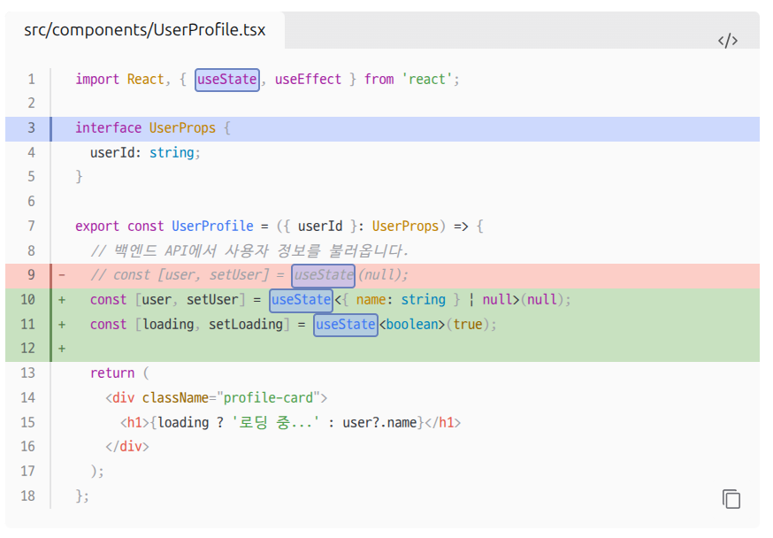
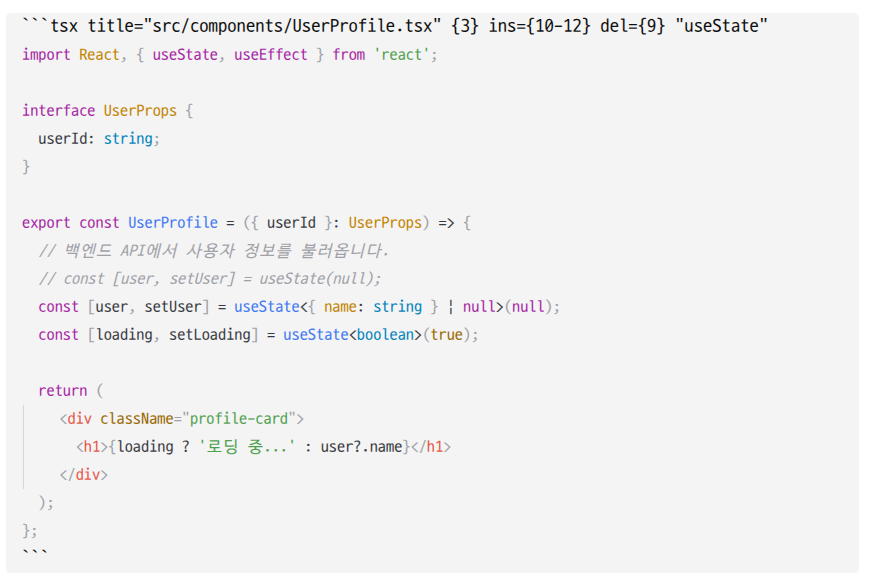
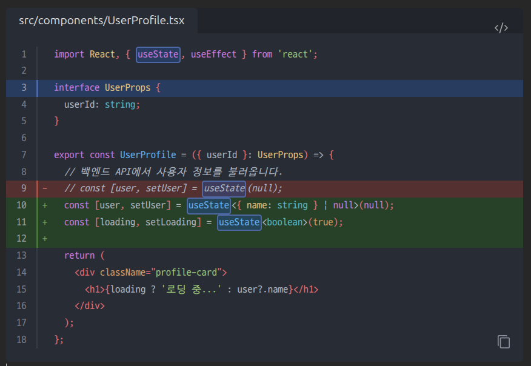
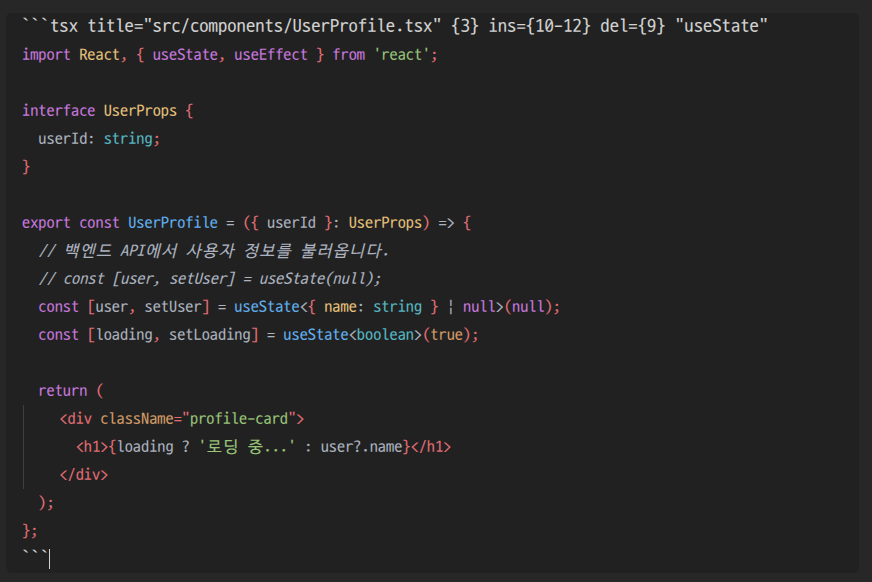

# Obsidian PrismJS Expressive Code Highlighter

> [!WARNING]
> 이 플러그인은 AI 주도로 개발되었기 때문에 사용 시 주의가 필요합니다.
>
> 번들 크기를 줄이기 위해 `One Dark Pro` 및 `One Light` 테마만 기본 포함하고 있습니다.
> 다른 테마를 사용하고 싶다면, [src/config.ts](./src/config.ts) 파일을 수정해 주세요.

[Shiki Highlighter](https://github.com/mProjectsCode/obsidian-shiki-plugin)를 포크하여 `shikijs` 대신 `prismjs` 기반으로 동작하도록 커스텀 제작된 Obsidian 플러그인입니다. Expressive Code 엔진을 활용하여 읽기 모드(Reading View) 및 실시간 미리보기(Live Preview Editing View) 모두에서 풍부하고 정교한 코드 블록 하이라이팅 및 렌더링을 제공하며, IME 입력 처리 및 렌더링 최적화를 통해 UI 프리징 현상을 해결했습니다.

## 주요 기능 (Features)

- **Expressive Code + PrismJS 결합 렌더링**: 빠른 속도와 높은 확장성을 자랑하는 PrismJS 토크나이저와 Expressive Code의 리치 코드 블록 프레임/어노테이션 기능을 결합했습니다.
- **실시간 자동 적용 설정 (Auto-Reload)**: 설정 탭에서 설정을 변경하는 즉시 수동 새로고침 없이 코드 블록에 실시간으로 반영됩니다.
- **한국어 설정 탭 제공**: 설정 탭 내 모든 옵션과 설명을 한국어로 제공합니다.
- **다양한 코드 블록 커스텀 옵션**:
  - **줄 번호 표시**: 코드 블록의 기본 줄 번호 표시 여부 설정
  - **자동 줄 바꿈**: 긴 코드 줄의 자동 줄 바꿈 설정
  - **프레임 스타일**: `자동 (Auto)`, `코드 (Code)`, `터미널 (Terminal)`, `사용 안 함 (None)`
  - **접기 스타일**: `자동 접기 (Collapsible Auto)`, `시작 위치 접기`, `끝 위치 접기`, `GitHub 스타일 (다시 접기 불가)`
- **다크/라이트 테마 동적 전환**: Obsidian 기본 테마 모드(다크/라이트)에 맞춰 지정한 구문 테마(`One Dark Pro`, `One Light`)를 동적으로 적용합니다.
- **일관된 고정폭 폰트 적용**: 읽기 모드 및 편집 모드 전체에서 Obsidian 설정의 고정폭 폰트(`var(--font-monospace)`)가 일관되게 적용됩니다.

## 설치 방법 (How to install)

### 1. GitHub Releases를 통한 설치

[GitHub Releases](https://github.com/bmcyver/obsidian-prism-expressive-code/releases/latest) 페이지에서 `main.js`, `manifest.json`, `styles.css` 파일을 다운로드하여 Obsidian 보관소(Vault)의 `.obsidian/plugins/obsidian-prism-expressive-code/` 디렉토리에 저장합니다.

### 2. 소스코드 직접 빌드

```bash
git clone https://github.com/bmcyver/obsidian-prism-expressive-code.git && cd obsidian-prism-expressive-code
pnpm install --frozen-lockfile
pnpm --filter=@expressive-code/core run build
pnpm run build
```

빌드가 완료되면 `dist/` 폴더 내의 `main.js`, `manifest.json`, `styles.css` 파일을 `.obsidian/plugins/obsidian-prism-expressive-code/` 폴더에 복사합니다.

## 스크린샷 (Screenshots)

<table>
  <tr>
    <td></td>
    <td></td>
  </tr>
  <tr>
    <td></td>
    <td></td>
  </tr>
</table>

## 라이선스 (Licenses)

- [Shiki Highlighter](https://github.com/mProjectsCode/obsidian-shiki-plugin) 원본 코드는 [MIT License](https://github.com/mProjectsCode/obsidian-shiki-plugin/blob/master/LICENSE)를 따릅니다.
- 본 저장소에서 새로 작성되거나 수정된 코드는 [MIT License](./LICENSE)가 부여됩니다.